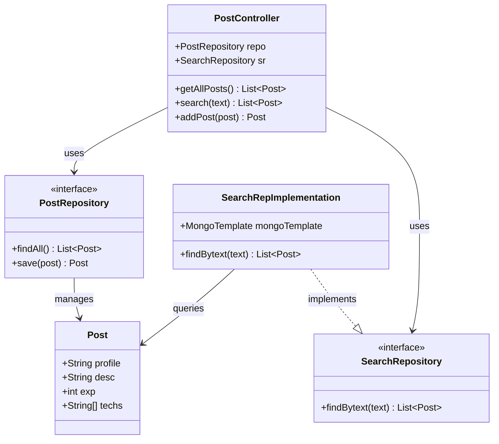

<!-- Badges -->
<p align="center">
  
  
  
  
  
  
</p>

<h1 align="center">JobBoard</h1>
<p align="center">A full-stack job listing platform built with Spring Boot and React — post open positions, browse listings, and search by role, skill, or keyword.</p>

---

## Table of Contents

- [Project Overview](#project-overview)
- [Backend](#backend)
  - [Backend Overview](#backend-overview)
  - [Technology Stack](#technology-stack)
  - [Backend Features](#backend-features)
  - [Database Design](#database-design)
  - [API Documentation](#api-documentation)
  - [Backend Folder Structure](#backend-folder-structure)
  - [Backend Setup](#backend-setup)
  - [Backend Design Diagram](#backend-design-diagram)
- [Frontend](#frontend)
  - [Frontend Overview](#frontend-overview)
  - [Technology Stack (Frontend)](#technology-stack-frontend)
  - [Frontend Features](#frontend-features)
  - [Pages and Components](#pages-and-components)
  - [API Integration](#api-integration)
  - [Frontend Folder Structure](#frontend-folder-structure)
  - [Frontend Setup](#frontend-setup)
  - [Frontend Design Diagram](#frontend-design-diagram)
- [Full System Architecture](#full-system-architecture)
- [Screenshots](#screenshots)
- [Future Improvements](#future-improvements)
- [Author](#author)

---

## Project Overview

**JobBoard** is a lightweight, full-stack job listing application. It solves a common hiring workflow problem: teams need a simple internal board to post open positions and let candidates discover them by skill or keyword — without the overhead of a third-party platform.

### Main Features

- Browse all open job listings in a card-based grid layout
- Search across job title, description, and required technologies with instant results
- Post new job listings through a guided form with interactive technology tag input
- Fully responsive UI with skeleton loading states, empty states, and error handling

### High-Level Architecture

The system is divided into two independently runnable applications:

| Layer | Technology | Port |
|---|---|---|
| Frontend SPA | React + Vite | `3000` |
| REST API | Spring Boot (Tomcat) | `8080` |
| Database | MongoDB Atlas | Cloud |

The frontend communicates exclusively with the backend through a JSON REST API. There is no server-side rendering; all view logic lives in the React application.

---

# Backend

## Backend Overview

The backend is a Spring Boot 3 REST API organized into three standard layers: **controller**, **model**, and **repository**. There is no dedicated service layer at this scale — the controller delegates directly to repository interfaces, keeping the request path short and easy to trace.

### Package Structure

```
com.sanacodes.joblisting
├── controller    ← Handles HTTP; maps requests to repository calls
├── model         ← Domain object; maps to MongoDB collection
└── repository    ← Data access; one CRUD interface + one search interface
```

### Request Flow

```
HTTP Request
     │
     ▼
PostController          (@RestController, @CrossOrigin)
     │
     ├─── GET /allPosts ──────► PostRepository.findAll()
     │                                   │
     ├─── GET /posts/{text} ──► SearchRepImplementation.findBytext()
     │                          (MongoTemplate + Criteria regex)
     │
     └─── POST /post ─────────► PostRepository.save(post)
                                           │
                                           ▼
                                   MongoDB  ·  JobPost collection
```

---

## Technology Stack

| Technology | Version | Role |
|---|---|---|
| Java | 21 | Language |
| Spring Boot | 3.5.6 | Framework and embedded Tomcat server |
| Spring Web | (via Boot) | REST controller, request mapping, CORS |
| Spring Data MongoDB | (via Boot) | `MongoRepository`, `MongoTemplate`, entity mapping |
| MongoDB Atlas | Cloud | Hosted NoSQL database |
| Maven Wrapper | 3.9+ | Build and dependency management |
| JUnit 5 / Spring Boot Test | (via Boot) | Testing framework |

---

## Backend Features

| Feature | Implementation |
|---|---|
| List all job posts | `GET /allPosts` — delegates to `MongoRepository.findAll()` |
| Full-text search | `GET /posts/{text}` — case-insensitive `$regex` via `MongoTemplate.find()` across three fields |
| Create a job post | `POST /post` — deserialises request body into `Post`, persists with `MongoRepository.save()` |
| CORS support | `@CrossOrigin(origins = "http://localhost:3000")` on controller class; per-method annotation on each handler |
| Auto-wired dependencies | Spring `@Autowired` used throughout; no manual bean construction |
| Context smoke test | `JoblistingApplicationTests` — verifies the Spring context loads successfully |

---

## Database Design

### Collection: `JobPost`

Declared via `@Document("JobPost")` on the `Post` entity class. MongoDB creates the collection automatically on first write.

| Field | BSON Type | Java Type | Nullable | Description |
|---|---|---|---|---|
| `_id` | `ObjectId` | — (auto-generated) | No | MongoDB primary key |
| `profile` | `string` | `String` | Yes | Job title or role name |
| `desc` | `string` | `String` | Yes | Full description of the position |
| `exp` | `int32` | `int` | No | Minimum years of experience required |
| `techs` | `array<string>` | `String[]` | Yes | List of required technologies |

**Notes:**
- The `_id` field is not exposed in the `Post` class, so it does not appear in API responses.
- The `techs` field is a native BSON array, enabling element-level regex matching in search queries.
- There are no relationships to other collections; the schema is intentionally flat.
- No search indexes are required. The search feature uses a standard `$regex` query, which works on any MongoDB instance without cluster-level configuration.

### Sample Document

```json
{
  "_id": { "$oid": "665f1a2b3c4d5e6f7a8b9c0d" },
  "profile": "Backend Developer",
  "desc": "Build and maintain RESTful APIs using Java and Spring Boot.",
  "exp": 3,
  "techs": ["Java", "Spring Boot", "MongoDB", "REST APIs"]
}
```

---

## API Documentation

**Base URL:** `http://localhost:8080`

**Content-Type:** All responses are `application/json`.

**Authentication:** None (open API).

---

### `GET /allPosts`

Returns every job post stored in the database.

| | |
|---|---|
| **Method** | `GET` |
| **URL** | `/allPosts` |
| **Request Body** | None |
| **Success Status** | `200 OK` |

**Response Body** — array of Post objects:

```json
[
  {
    "profile": "Backend Developer",
    "desc": "Build and maintain RESTful APIs using Java and Spring Boot.",
    "exp": 3,
    "techs": ["Java", "Spring Boot", "MongoDB"]
  },
  {
    "profile": "Frontend Engineer",
    "desc": "Build responsive UIs with React and TypeScript.",
    "exp": 2,
    "techs": ["React", "TypeScript", "CSS"]
  }
]
```

---

### `GET /posts/{text}`

Searches job posts using a case-insensitive substring match. The search term is matched against `profile`, `desc`, and `techs` simultaneously using MongoDB `$or` + `$regex`. A document is returned if any one of those fields contains the search term.

| | |
|---|---|
| **Method** | `GET` |
| **URL** | `/posts/{text}` |
| **Path Parameter** | `text` — the search keyword (URL-encoded by the frontend) |
| **Request Body** | None |
| **Success Status** | `200 OK` |
| **Match behaviour** | Case-insensitive substring — `"java"` matches `"Java"`, `"JavaScript"`, etc. |

**Example request:**

```bash
curl "http://localhost:8080/posts/spring%20boot"
```

**Response Body:**

```json
[
  {
    "profile": "Backend Developer",
    "desc": "Build and maintain RESTful APIs using Java and Spring Boot.",
    "exp": 3,
    "techs": ["Java", "Spring Boot", "MongoDB"]
  }
]
```

Returns `[]` when no posts match.

---

### `POST /post`

Creates and persists a new job post. Returns the saved document.

| | |
|---|---|
| **Method** | `POST` |
| **URL** | `/post` |
| **Content-Type** | `application/json` |
| **Success Status** | `200 OK` |
| **Response Body** | The saved `Post` object |

**Request Body Fields:**

| Field | Type | Required | Constraints | Description |
|---|---|---|---|---|
| `profile` | `string` | Yes | — | Job title or role |
| `desc` | `string` | Yes | — | Full job description |
| `exp` | `integer` | Yes | `>= 0` | Minimum years of experience |
| `techs` | `string[]` | No | — | Required technologies |

**Example request:**

```bash
curl -X POST http://localhost:8080/post \
  -H "Content-Type: application/json" \
  -d '{
    "profile": "DevOps Engineer",
    "desc": "Manage CI/CD pipelines and cloud infrastructure.",
    "exp": 4,
    "techs": ["Kubernetes", "Docker", "AWS", "Terraform"]
  }'
```

**Response Body:**

```json
{
  "profile": "DevOps Engineer",
  "desc": "Manage CI/CD pipelines and cloud infrastructure.",
  "exp": 4,
  "techs": ["Kubernetes", "Docker", "AWS", "Terraform"]
}
```

---

## Backend Folder Structure

```
joblisting/
├── src/
│   ├── main/
│   │   ├── java/com/sanacodes/joblisting/
│   │   │   ├── JoblistingApplication.java        ← Entry point (@SpringBootApplication)
│   │   │   ├── controller/
│   │   │   │   └── PostController.java           ← REST endpoints + CORS config
│   │   │   ├── model/
│   │   │   │   └── Post.java                     ← MongoDB document model
│   │   │   └── repository/
│   │   │       ├── PostRepository.java           ← CRUD via MongoRepository<Post, String>
│   │   │       ├── SearchRepository.java         ← Custom search interface
│   │   │       └── SearchRepImplementation.java  ← Regex search via MongoTemplate
│   │   └── resources/
│   │       └── application.properties            ← MongoDB URI + database name
│   └── test/
│       └── java/com/sanacodes/joblisting/
│           └── JoblistingApplicationTests.java   ← Spring context smoke test
├── pom.xml                                       ← Dependencies and build config
├── mvnw                                          ← Maven Wrapper (Unix)
└── mvnw.cmd                                      ← Maven Wrapper (Windows)
```

---

## Backend Setup

### Prerequisites

| Requirement | Version |
|---|---|
| JDK | 21 or later |
| Maven | 3.9+ (or use the included `mvnw` / `mvnw.cmd`) |
| MongoDB | Atlas account (free M0 tier) or local MongoDB instance |

### MongoDB Configuration

1. Create a free cluster at [cloud.mongodb.com](https://cloud.mongodb.com).
2. Create a database user with **Read and Write** permissions.
3. Add your IP address to the **Network Access** allow-list (`0.0.0.0/0` for development).
4. Copy the **SRV connection string** from the Atlas UI.

### Environment Variables / Configuration

Edit `src/main/resources/application.properties`:

```properties
# Replace with your actual Atlas connection string
spring.data.mongodb.uri=mongodb+srv://<username>:<password>@<cluster>.mongodb.net/?retryWrites=true&w=majority&appName=<appName>

# The database to use (created automatically on first write)
spring.data.mongodb.database=Project
```

> **Security note:** Never commit real credentials to version control. Use environment variable substitution (`${MONGO_URI}`) or Spring profiles for production deployments.

### Running Locally

```bash
# Navigate to the backend directory
cd joblisting

# Build and package
mvn clean install

# Start the development server
mvn spring-boot:run
```

Or with the Maven Wrapper (no system Maven required):

```bash
./mvnw spring-boot:run        # macOS / Linux
mvnw.cmd spring-boot:run      # Windows
```

The API will be available at **http://localhost:8080**.

---

## Backend Design Diagram



---

# Frontend

## Frontend Overview

The frontend is a single-page application built with React 18 and bundled by Vite. It uses React Router DOM for client-side routing between two pages, plain CSS files for styling (one per component), and Axios for all HTTP communication with the backend.

### User Flow

```
User opens app
     │
     ▼
Navbar (persistent)
  ├── "Browse Jobs" link → /
  └── "Post a Job" link  → /post

/ (BrowseJobs)
  ├── On mount: fetch all posts → render PostCard grid
  ├── Search input: fetch matching posts → update grid + result count
  └── Clear search: reload all posts

/post (PostJob)
  ├── Fill form fields (title, description, experience, technologies)
  ├── Add technology tags interactively (Enter or comma to add, click ✕ to remove)
  └── Submit: POST to API → success/error alert → form reset
```

### Design Approach

- Scoped CSS: each component and page imports its own dedicated `.css` file
- A single `global.css` defines base resets and shared design tokens
- Loading states use skeleton card placeholders (no spinner) for perceived performance
- Empty and error states are explicitly handled at the page level

---

## Technology Stack (Frontend)

| Technology | Version | Role |
|---|---|---|
| React | 18.3.1 | UI library; functional components with hooks |
| React DOM | 18.3.1 | DOM rendering via `createRoot` |
| React Router DOM | 6.23.1 | Client-side routing (`BrowserRouter`, `Route`, `NavLink`) |
| Axios | 1.7.2 | HTTP client with base URL config and JSON headers |
| Vite | 5.3.1 | Dev server with HMR; production bundler |
| @vitejs/plugin-react | 4.3.1 | Babel-based JSX transform for Vite |
| Plain CSS | — | Component-scoped stylesheets; no CSS-in-JS or utility framework |

---

## Frontend Features

| Feature | Component | Detail |
|---|---|---|
| Browse all jobs | `BrowseJobs` | Fetches `GET /allPosts` on mount; renders a responsive card grid |
| Live result count | `BrowseJobs` | Shows "N open positions" or "N results for '…'" |
| Skeleton loading | `BrowseJobs` | 3 placeholder cards shown while fetching |
| Empty state | `BrowseJobs` | Friendly message with optional "Clear search" button |
| Error state | `BrowseJobs` | Inline error message when the API is unreachable |
| Keyword search | `SearchBar` + `BrowseJobs` | Calls `GET /posts/{text}`; updates grid without page reload |
| Clear search | `SearchBar` | Visible only when a query is active; reloads all posts |
| Post a job | `PostJob` | Controlled form: title, description, experience, technologies |
| Tag chip input | `PostJob` | Press Enter or comma to add a technology tag; click ✕ to remove |
| Client-side validation | `PostJob` | Submit button disabled until title, description, and experience are filled |
| Submit feedback | `PostJob` | Inline success or error alert; form resets on success |
| Active nav links | `Navbar` | `NavLink` applies `active` CSS class to the current route |

---

## Pages and Components

### Pages

| Route | File | Description |
|---|---|---|
| `/` | `src/pages/BrowseJobs.jsx` | Main landing page — displays all job listings with search, loading, and empty states |
| `/post` | `src/pages/PostJob.jsx` | Job submission form with interactive technology tag management |

### Components

| Component | File | Props | Description |
|---|---|---|---|
| `Navbar` | `src/components/Navbar.jsx` | — | Top navigation bar with `NavLink` active-state highlighting |
| `PostCard` | `src/components/PostCard.jsx` | `post: { profile, desc, exp, techs }` | Renders one job listing — title, experience badge, description, tech tags |
| `SearchBar` | `src/components/SearchBar.jsx` | `onSearch`, `onClear`, `loading` | Controlled search form with clear button and loading-disabled state |

### Stylesheets

| File | Scope |
|---|---|
| `src/styles/global.css` | Global base resets and shared design tokens |
| `src/styles/Navbar.css` | Navbar layout and active link styles |
| `src/styles/BrowseJobs.css` | Hero section, card grid, skeleton, empty/error states |
| `src/styles/PostCard.css` | Card layout, experience badge, tech tag chips |
| `src/styles/SearchBar.css` | Search input, clear button, search button |
| `src/styles/PostJob.css` | Form card layout, form groups, tag chip editor |

---

## API Integration

All backend communication is centralised in `src/api/client.js`. A single Axios instance is created with a shared `baseURL` and `Content-Type` header. All components import from this module — no component constructs its own fetch call.

```js
// src/api/client.js
const client = axios.create({
  baseURL: 'http://localhost:8080',
  headers: { 'Content-Type': 'application/json' },
})

export const getAllPosts = () => client.get('/allPosts')
export const searchPosts = (text) => client.get(`/posts/${encodeURIComponent(text)}`)
export const createPost  = (post) => client.post('/post', post)
```

| Function | HTTP | Backend Endpoint | Called By |
|---|---|---|---|
| `getAllPosts()` | `GET` | `/allPosts` | `BrowseJobs` on mount and on search clear |
| `searchPosts(text)` | `GET` | `/posts/{text}` | `BrowseJobs` when `SearchBar` submits |
| `createPost(post)` | `POST` | `/post` | `PostJob` on form submit |

The search term is passed through `encodeURIComponent()` before being interpolated into the URL path, ensuring special characters and spaces are safely encoded.

---

## Frontend Folder Structure

```
frontend/
├── src/
│   ├── api/
│   │   └── client.js           ← Axios instance + all API functions
│   ├── components/
│   │   ├── Navbar.jsx          ← Top navigation (NavLink active states)
│   │   ├── PostCard.jsx        ← Job listing card
│   │   └── SearchBar.jsx       ← Search input with clear and loading states
│   ├── pages/
│   │   ├── BrowseJobs.jsx      ← / route (list + search)
│   │   └── PostJob.jsx         ← /post route (create form)
│   ├── styles/
│   │   ├── global.css
│   │   ├── Navbar.css
│   │   ├── BrowseJobs.css
│   │   ├── PostCard.css
│   │   ├── SearchBar.css
│   │   └── PostJob.css
│   ├── App.jsx                 ← BrowserRouter, Routes, Navbar layout
│   └── main.jsx                ← createRoot entry point
├── dist/                       ← Production build output (Vite)
├── index.html                  ← Vite HTML entry point
└── package.json
```

---

## Frontend Setup

### Prerequisites

| Requirement | Version |
|---|---|
| Node.js | 18 or later |
| npm | 9 or later |

### Running Locally

```bash
# Navigate to the frontend directory
cd frontend

# Install dependencies
npm install

# Start the Vite development server (with hot module replacement)
npm run dev
```

The app will be available at **http://localhost:3000** (or the port shown in terminal output).

### Additional Commands

```bash
# Build for production
npm run build

# Preview the production build locally
npm run preview
```

---

## Frontend Design Diagram

```mermaid
graph TD
    A[main.jsx<br/>createRoot] --> B[App.jsx<br/>BrowserRouter]
    B --> C[Navbar.jsx]
    B --> D{React Router}
    D -->|path='/'| E[BrowseJobs.jsx]
    D -->|path='/post'| F[PostJob.jsx]

    E --> G[SearchBar.jsx]
    E --> H[PostCard.jsx ×N]

    E -->|on mount / clear| I[getAllPosts]
    E -->|on search| J[searchPosts]
    F -->|on submit| K[createPost]

    I --> L[GET /allPosts]
    J --> M[GET /posts/{text}]
    K --> N[POST /post]

    style A fill:#61DAFB,color:#000
    style B fill:#61DAFB,color:#000
    style C fill:#61DAFB,color:#000
    style E fill:#61DAFB,color:#000
    style F fill:#61DAFB,color:#000
    style G fill:#61DAFB,color:#000
    style H fill:#61DAFB,color:#000
    style L fill:#6DB33F,color:#fff
    style M fill:#6DB33F,color:#fff
    style N fill:#6DB33F,color:#fff
```

---

# Full System Architecture

```mermaid
graph LR
    subgraph Browser
        U[User]
        SPA[React SPA<br/>localhost:3000]
        U -->|interacts| SPA
    end

    subgraph Backend [Spring Boot API · localhost:8080]
        PC[PostController]
        PR[PostRepository<br/>MongoRepository]
        SR[SearchRepImpl<br/>MongoTemplate + Regex]
        PC --> PR
        PC --> SR
    end

    subgraph Database [MongoDB Atlas · Cloud]
        DB[(Project DB<br/>JobPost collection)]
    end

    SPA -->|GET /allPosts| PC
    SPA -->|GET /posts/{text}| PC
    SPA -->|POST /post| PC
    PR -->|CRUD| DB
    SR -->|regex query| DB

    style SPA fill:#61DAFB,color:#000
    style PC fill:#6DB33F,color:#fff
    style PR fill:#6DB33F,color:#fff
    style SR fill:#6DB33F,color:#fff
    style DB fill:#47A248,color:#fff
```

---

# Screenshots

> **Note:** Screenshots to be added after the application is running.

### Browse Jobs Page

| State | Screenshot |
|---|---|
| Loaded | *(Add screenshot: homepage with job cards)* |
| Search results | *(Add screenshot: filtered results for a keyword)* |
| Empty state | *(Add screenshot: "No job posts found" screen)* |
| Loading (skeleton) | *(Add screenshot: skeleton card placeholders)* |

### Post a Job Page

| State | Screenshot |
|---|---|
| Blank form | *(Add screenshot: empty form)* |
| With tech tags | *(Add screenshot: form with tech chip input filled)* |
| Success alert | *(Add screenshot: green "Job posted successfully!" banner)* |

---

# Future Improvements

### Backend

| Improvement | Description |
|---|---|
| Input validation | Add `spring-boot-starter-validation` and annotate `Post` with `@NotBlank`, `@Min` to return structured `400 Bad Request` errors |
| Expose document ID | Add `@Id String id` to `Post` so clients can reference specific documents for update/delete |
| Update & delete endpoints | `PUT /post/{id}` and `DELETE /post/{id}` to complete the CRUD surface |
| Service layer | Introduce `PostService` to decouple controllers from repositories and simplify unit testing |
| Externalise config | Replace hardcoded credentials in `application.properties` with environment variable placeholders (`${MONGO_URI}`) |
| Configurable CORS | Move the allowed origin into a config property instead of hardcoding `http://localhost:3000` |
| Search performance | For large datasets, a MongoDB text index (`{ profile: "text", desc: "text", techs: "text" }`) would replace the full-collection `$regex` scan |
| Pagination | Add `Pageable` support to `GET /allPosts` for datasets that grow beyond a few hundred documents |
| Docker Compose | Bundle the backend and a local MongoDB container for a fully offline development environment |

### Frontend

| Improvement | Description |
|---|---|
| Search debounce | Delay the API call while the user is still typing to reduce request volume |
| Job detail page | A `/jobs/:id` route showing the full post details when a card is clicked |
| Sort and filter | Allow filtering by experience range or sorting by newest/most experienced |
| Delete from UI | A recruiter-facing delete button on each card |
| Form validation messages | Show inline field errors instead of silently disabling the submit button |
| Environment variable for API URL | Replace the hardcoded `http://localhost:8080` in `client.js` with `import.meta.env.VITE_API_URL` |
| Error boundary | Wrap the route tree in a React error boundary to catch unexpected render failures |

---


---

<p align="center">
  Built with Spring Boot &amp; React
</p>
